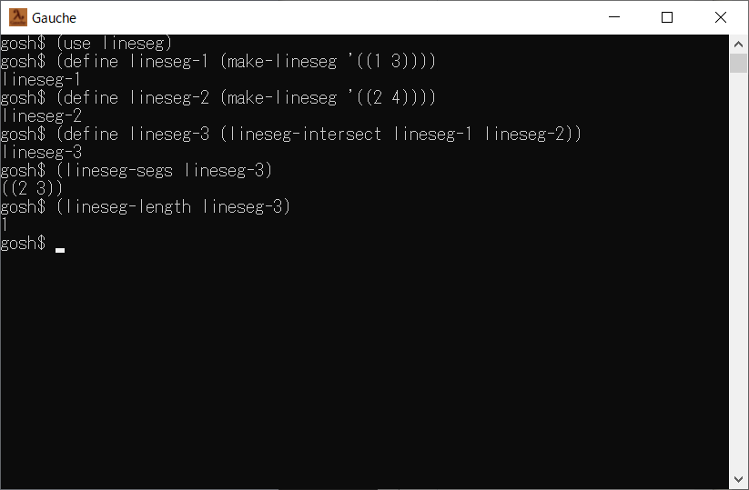

# lineseg



## 概要
- Gauche で、数直線上の線分を扱うためのモジュールです。


## インストール方法
- lineseg.scm を Gauche でロード可能なフォルダにコピーします。  
  (例えば (gauche-site-library-directory) で表示されるフォルダ等)


## 使い方
- 以下を実行します。
  ```
    (use lineseg)
  ```
  以後、本モジュールが使用可能になります。

- 使用可能な手続きを以下に示します。
  - `(make-lineseg segs [:comparator cmpr] [:add-func add] [:sub-func sub])`
    - 線分クラス `<lineseg>` のインスタンスを生成します。  
      引数 segs には、線分 (start end) の集合 (リスト) を指定します。  
      ( 例. '((1 2) (3 4)) )  
      ( リストのリストになることに注意 )  
      また、end は、start 以上の値である必要があります。

    - 以下のキーワード引数は、線分の start と end に、  
      数値以外のデータを格納したい場合に使用できます。

    - キーワード引数 :comparator の cmpr には、比較器を指定します。  
      省略時は default-comparator を指定したことになります。

    - キーワード引数 :add-func の add には、加算関数を指定します。  
      省略時は + を指定したことになります。

    - キーワード引数 :sub-func の sub には、減算関数を指定します。  
      省略時は - を指定したことになります。

  - `(lineseg-copy lineseg1)`
    - 線分クラスのインスタンスをコピーします。

  - `(lineseg-length lineseg1)`
    - 線分の長さを取得します。  
      ( 長さの計算には、make-lineseg で指定した 加算/減算関数 が使用されます )

  - `(lineseg-segs lineseg1)`
    - 線分の集合を、(リストのリストとして) 取得します。

  - `(lineseg-contains? lineseg1 val)`
    - 線分に値が含まれるかどうかをチェックします。  
      線分に値が含まれれば #t を返し、含まれなければ #f を返します。

  - `(lineseg-intersect lineseg1 lineseg2 ...)`
    - 線分の積集合を、(線分クラスのインスタンスとして) 取得します。  
      ( 例えば、'((1 3)) と '((2 4)) の積集合 (共通部分) は、'((2 3)) になります )

  - `(lineseg-union lineseg1 lineseg2 ...)`
    - 線分の和集合を、(線分クラスのインスタンスとして) 取得します。  
      ( 例えば、'((1 3)) と '((2 4)) の和集合 (合わせたもの) は、'((1 4)) になります )

  - `(lineseg-subtract lineseg1 lineseg2 ...)`
    - 線分の差集合を、(線分クラスのインスタンスとして) 取得します。  
      ( 例えば、'((1 5)) と '((2 4)) の差集合 (取り除いたもの) は、'((1 2) (4 5)) になります )


## 使用例
1. sample-date-time.scm は、線分の start と end に、  
   `<date>` クラスのインスタンスを格納した例になっています。  
   日時の範囲を設定して、各種勤務時間を計算しています。


## 環境等
- OS
  - Windows 10 (version 21H2) (64bit)
- 言語
  - Gauche v0.9.12

## 履歴
- 2022-9-13  v1.00 (初版)
- 2022-9-14  v1.01 lineseg-segs を追加
- 2022-9-14  v1.02 初期値修正
- 2022-9-14  v1.03 lineseg-subtract を修正
- 2022-9-19  v1.04 lineseg-contains? を追加
- 2022-9-19  v1.05 一部処理見直し


(2022-9-19)
